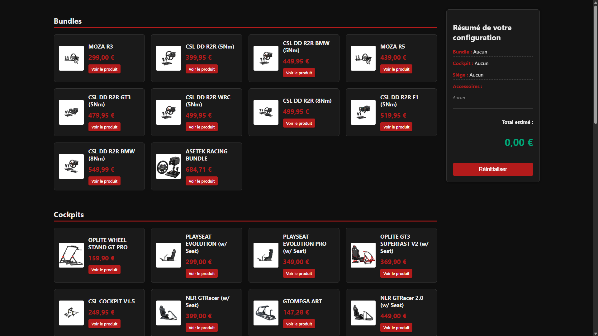
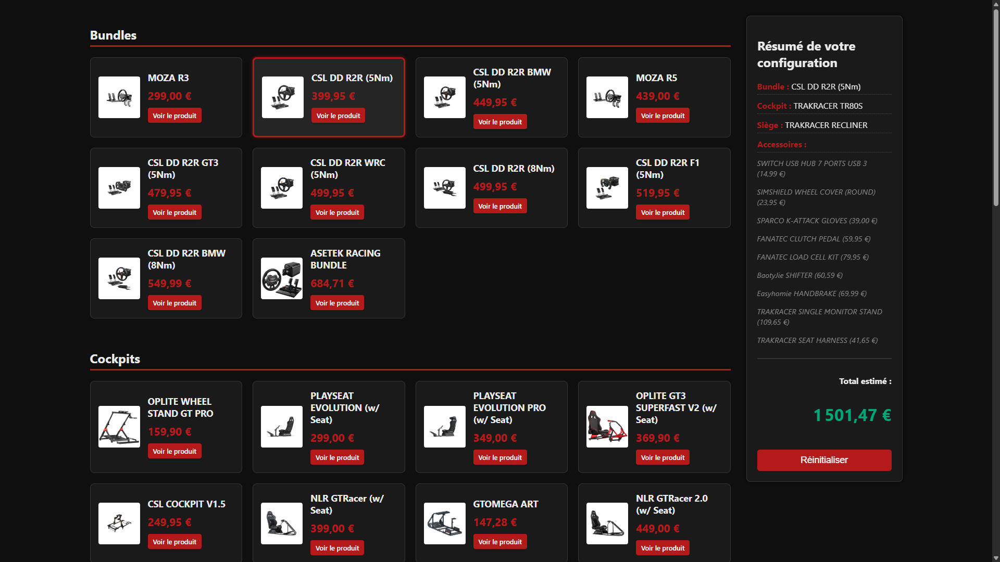

<div align="center">
   
   
   
   
   
</div>

# LiftIt

Application web légère pour configurer et estimer une configuration simracing (bundles, cockpits, sièges et accessoires).

## Table des matières

- [Présentation](#présentation)
- [Comment utiliser](#comment-utiliser)
- [Fonctionnalités](#fonctionnalités)
- [Démonstration locale](#démonstration-locale)
- [Structure du projet](#structure-du-projet)
- [Contribuer](#contribuer)

## Présentation

LiftIt est une interface client simple pour construire une configuration simracing en sélectionnant un bundle, un cockpit, un siège et des accessoires. L'application calcule le total estimé, conserve la sélection dans le navigateur (LocalStorage) et propose un résumé clair.

L'interface est conçue pour être utilisée directement dans le navigateur sans backend nécessaire.

## Comment utiliser

1. Cloner le dépôt :

```bash
git clone https://github.com/LoupesDEV/LiftIt.git
```

2. Ouvrir l'application :

- Avec **VSCode** : clic-droit sur `index.html` → *Open with Live Server* (extension recommandée).
- Avec **Python** (serveur local simple) :

```powershell
python -m http.server 8000
# puis ouvrir http://localhost:8000
```

3. Naviguer dans l'interface, sélectionner les éléments souhaités et consulter le résumé dans le panneau de droite.

## Fonctionnalités

- **Sélection simple** : Choix d'un bundle, d'un cockpit, d'un siège et d'accessoires.
- **Sélection multiple pour accessoires** : Ajouter/supprimer plusieurs accessoires.
- **Résumé dynamique** : Aperçu instantané de la sélection (noms et prix).
- **Calcul du total** : Somme automatique des articles sélectionnés.
- **Persistance côté client** : Sauvegarde de la configuration dans `localStorage` pour reprise ultérieure.
- **Réinitialisation** : Bouton pour remettre la configuration à zéro.
- **Liens produits** : Les cartes peuvent contenir un lien vers la page du produit (ouverture dans un nouvel onglet).

## Démonstration locale

Vous pouvez tester l'application [ici](https://www.matheo-pichotmoise.fr/LiftIt).

<div align="center">
    <table>
        <tr>
            <td></td>
            <td></td>
        </tr>
    </table>
</div>

## Structure du projet

```
LiftIt
├─ assets/                # Dossier contenant les médias
├─ CODE_OF_CONDUCT.md     # Code de conduite pour les contributeurs
├─ CONTRIBUTING.md        # Guide de contribution
├─ data.json              # Données des équipements
├─ index.html             # Page principale l'application
├─ LICENSE                # Fichier de licence
├─ README.md              # Documentation du projet
├─ script.js              # Fichier de script
└─ styles.css             # Fichier de styles
```

# Contributeurs

Merci aux personnes et ressources ayant contribué au projet:

- [LoupesDEV](https://github.com/LoupesDEV) — Développement principal, conception et maintenance.

Vous souhaitez contribuer ? Consultez le [guide de contribution](CONTRIBUTING.md) ou ouvrez une *issue* pour proposer
des améliorations.

<p align="center">
    
    <br><br>
    
</p>